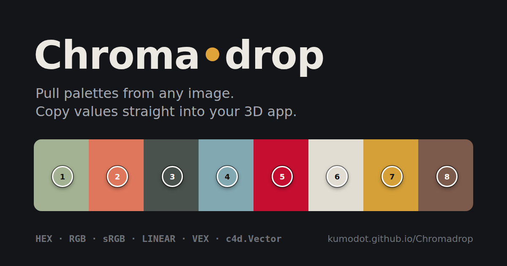
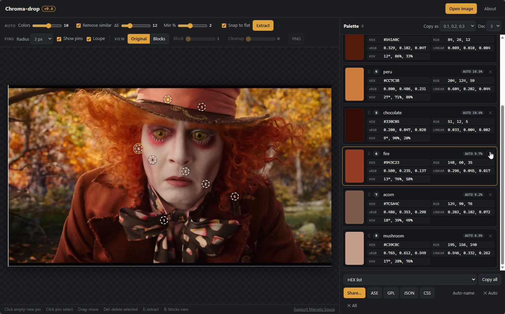
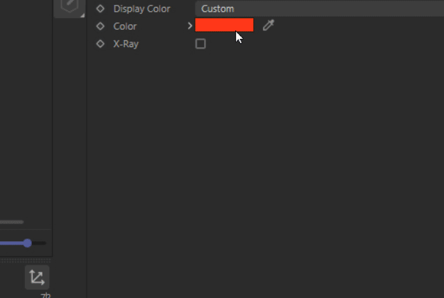
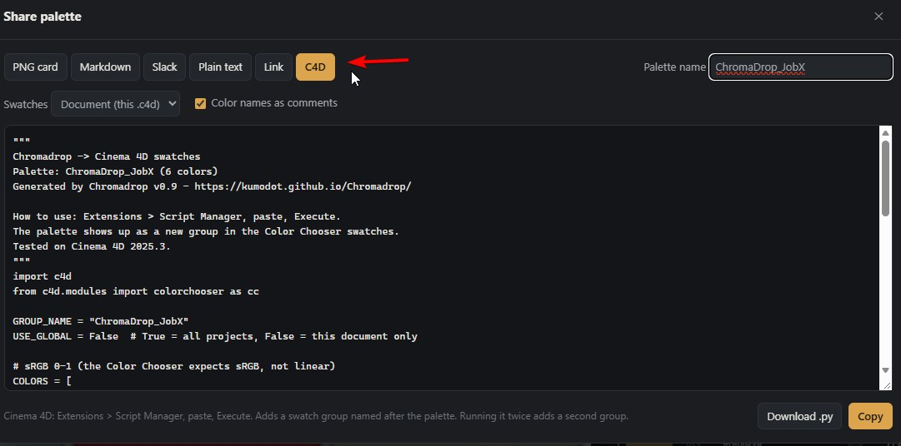
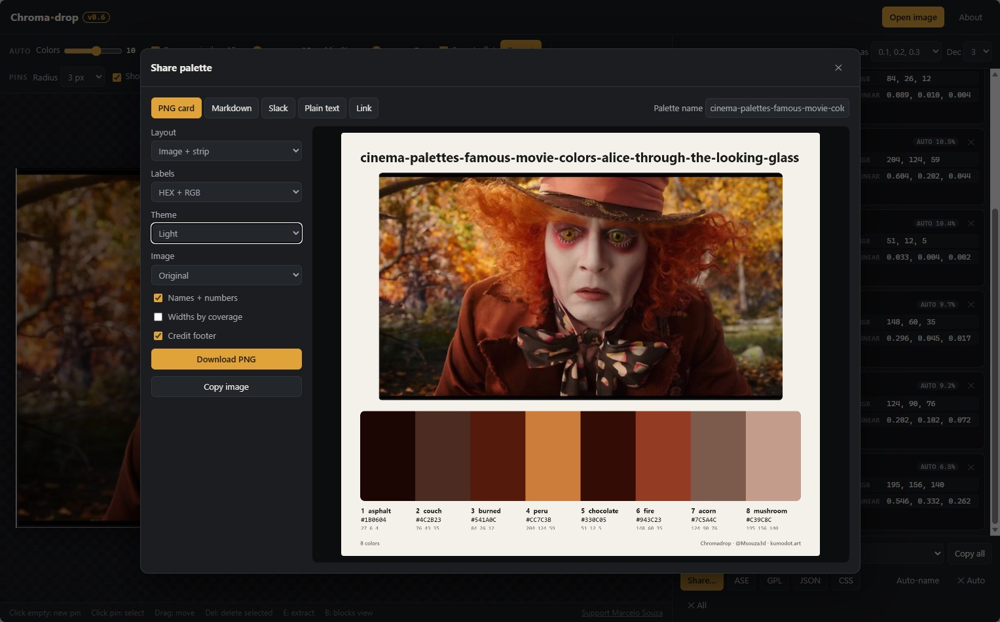

  

  <b>Pull color palettes from any image and copy the values straight into your 3D app.</b> 
  <b>One click turns any palette into Cinema 4D swatches.</b> 
  Free, single HTML file, runs 100% in the browser. Nothing is uploaded.

  <a href="https://kumodot.github.io/Chromadrop/"><b>▶ Open Chromadrop</b></a> ·
  <a href="https://ko-fi.com/msouza3d"><b>☕ Support Marcelo Souza</b></a>

---

## 🎨 Palettes straight into Cinema 4D

Build a palette in Chromadrop and send it to Cinema 4D's **Color Chooser swatches** in seconds. No manual typing, no color drift.

  

1. Open **Share → C4D**, set the palette name, pick **Document** (saved with the .c4d) or **Global** (every project).
2. Hit **Copy** (or **Download .py**).
3. In Cinema 4D: **Extensions → Script Manager**, paste, **Execute**.

The palette shows up as a new swatch group named after your palette, with the exact same colors. Values are written as sRGB 0-1, which is what the Color Chooser expects. Tested on Cinema 4D 2025.3.

  

## Features (v0.10.1)

- **Cinema 4D swatches**: generates a script that adds your palette to C4D's Color Chooser, Document or Global.
- **History**: a palette library in a drawer over the image (`H`). Drag **Save** onto it, name it, then load, add, rename, delete and reorder. Sort by name, date or color. Only colors and names are stored (in your browser), never the image. Export / import as `.json`.
- **ACEScg values**: every color also shows its ACEScg (AP1 linear) value, for raw numbers in an ACES render pipeline (VEX, Python, typed node values). Toggle in Settings.
- **Smart pins**: auto extract (weighted k-means in CIELAB) drops numbered pins on each dominant color. Controls for max colors, min coverage % and "snap to flat" (exact colors for flat art). Sliders update live.
- **Edit pins freely**: drag any pin to resample, click empty space to add one, select and press `Del` to remove. Pins you add or move are kept when you re-extract. Adjustable sample radius and loupe.
- **Remove similar**: drops auto colors that are too close to each other or to your pins (adjustable ΔE).
- **Auto names**: every color gets a short, unique, single-word name (`sage`, `jaffa`, `trout`...) from the nearest match in OKLab. Edit a name to lock it; "Auto-name" refreshes all.
- **Click to copy**: HEX, RGB 0-255, sRGB 0-1, Linear 0-1, HSV. Wrap styles: plain, Python tuple, VEX `{}`, `c4d.Vector()`, GLSL `vec3()`.
- **Blocks view**: the image rebuilt with only your palette colors, with mosaic block size and a cleanup filter that eats small specks. Export as PNG.
- **Copy all**: HEX / RGB / sRGB / Linear lists, Python list, VEX `vector[]`, CSS vars, JSON.
- **Modules**: workspaces as tabs in the header (Image for now, Board and Script coming). Turn them on/off in Settings.

## Share

One window, three categories:

- **Image**: PNG card with image + palette strip or grid, names, HEX / RGB / Linear / ACEScg labels, dark or light theme. Download or copy straight into a chat.
- **Text**: Markdown table (GitHub, Notion, Obsidian), Slack message, plain text, and a **link** where the palette lives in the URL (no upload). Whoever opens it can drop their own image and see it rebuilt with your palette in Blocks view.
- **Apps**: Cinema 4D swatch script, ASE (Adobe, Affinity, Procreate import), GPL (GIMP, Krita, Inkscape), JSON, CSS.

## Run

- **Online**: <https://kumodot.github.io/Chromadrop/>
- **Local**: double-click `Run_Chromadrop.bat`, or open `Chromadrop_v0.10.1.html` in any modern browser. No install, no build.

Load images with Open, drag and drop, or `Ctrl+V`. Shortcuts: `E` extract, `B` blocks view, `H` history, `Del` remove selected pin, `Esc` deselect.

## Notes on color space

sRGB 0-1 is the image value divided by 255. Linear 0-1 has the sRGB curve removed, which is what renderers use internally. If a 3D app's color field shows display values (most UI pickers do), use sRGB. If you type into a raw vector or parameter in a linear workflow, use Linear.

## Credits

Color names come from the [xkcd color survey](https://xkcd.com/color/rgb/) (CC0) and the [color-name-list](https://github.com/meodai/color-names) "short" list, Copyright (c) 2017 David Aerne, MIT License. Both filtered to short, single-word names.

---

  Marcelo Souza / Kumodot.art - 2026 // <a href="https://instagram.com/msouza3d">@Msouza3d</a> · <a href="https://github.com/kumodot">GitHub</a> 
  <a href="https://ko-fi.com/msouza3d">☕ Support Marcelo Souza on Ko-fi</a>

